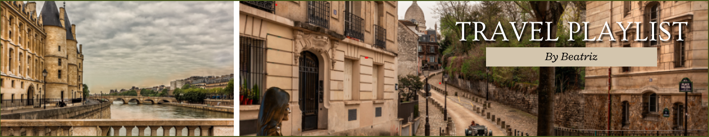

# Travel PLaylist

Hello, how are you? 👋🏼

Welcome to my travel playlist! This is a project I created to exercise my knowledge in some tools and save my travel wishes for places and events.
Hope you enjoy!
  
## 📑 Index
- <a href="#-project-functionalities">Project functionalities</a>
- <a href="#-layout">Layout</a>
- <a href="#-technologies-used">Technologies used</a>
- <a href="#-author">Author</a>
- <a href="#-next-steps">Next steps</a>
- <a href="#-see-you-soon">See you soon</a>
  
## 📱 Project functionalities

- [x] Dicover new places
- [x] Discover new world events
  

## 💻 Layout

- You can see my layout project in my figma account with this link: [Layout travel playlist](https://www.figma.com/file/KLWJnN6vpMvZR7vvXTxfH9/Travel-playlist?node-id=0%3A1&t=03byssRmY85UZzbF-0)
  

## 🛠 Technologies used
1. [Figma](https://www.figma.com/?fuid=)
2. [VS Code](https://code.visualstudio.com/)
3. [HTML](https://developer.mozilla.org/en-US/docs/Web/HTML)
4. [CSS](https://developer.mozilla.org/en-US/docs/Web/CSS)
  

## 👩🏻‍💻 Author

[Linkedin](https://www.linkedin.com/in/beatrizgo042/)
  

## 🚶🏻‍♀️ Next steps

- [ ] Add a map for a better geographic view
- [ ] Add cultural fun facts
- [ ] Add historical context to each place
- [ ] Make the project responsive

## See you soon

 I hope you like my project and if you have any ideas for improvement I would love to recive them by the e-mail address: beatrizgo042@gmail.com
 That's it, thank you and see you soon! 👋🏻
